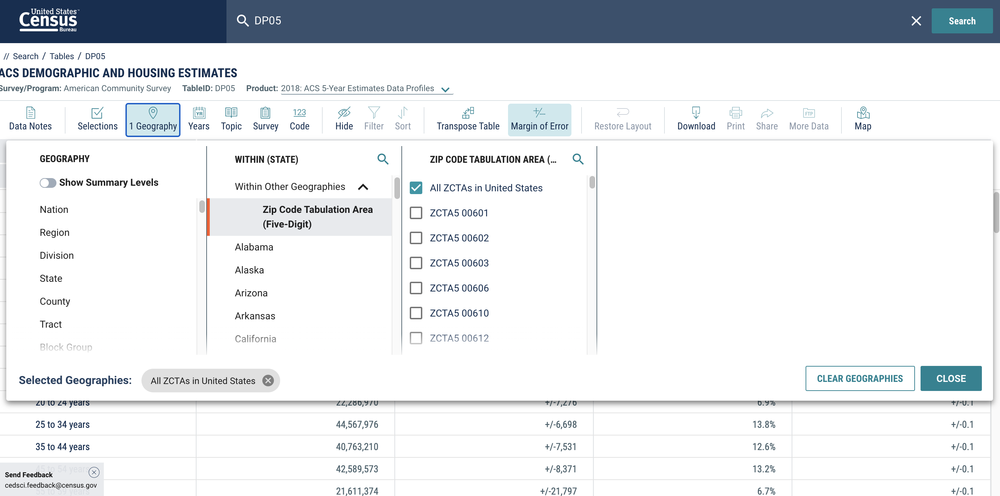

# R Script to Extract US Census Data by Zip Code

## Introduction 
This R script helps extract the population percentage estimates (for example, by race/ethnicity or language use) from the American Community Survey (ACS) and US Census for relevant zip codes. This script also includes a way to calculate an entropy value that represents the diversity of different racial/ethnic/language groups in that particular zip code (i.e., a way to weigh the number and amount of different racial/ethnic/language groups in a zip code) using the R package 'philentropy.'

Before using this script, download the relevant American Community Surveys from the US census download center: https://data.census.gov/cedsci/

## Race & Ethnicity
1) Go to https://data.census.gov/cedsci/
2) Search "DP05" 
3) click "ACS DEMOGRAPHIC AND HOUSING ESTIMATES"
4) click "Customize Table"
5) click "Geographies"
6) select "Zip Code Tabulation Area (Five-Digit)"
7) select "Within Other Geographies" below it "Zip Code Tabulation Area (Five-Digit)"
8) select "All ZCTAs in United States"
9) Then click "download" and select 2018

Below is a screenshot of how to access and download the correct dataset file for 2018 dataset:

### Description of columns of interests 

#### Major racial and ethnic categories

- GEO.id2 : zip code 
- DP05_0077PE : Percent; RACE - One race - White Alone
- DP05_0078PE : Percent; RACE - One race - Black or African American
- DP05_0079PE : Percent; RACE - One race - American Indian and Alaska Native
- DP05_0080PE : Percent; RACE - One race - Asian
- DP05_0081PE : Percent; RACE - One race - Native Hawaiian and Other Pacific Islander
- DP05_0071PE : Percent; RACE - One race - Hispanic
- DP05_0082PE : Percent; RACE - One race - Some other race
- DP05_0083PE : Percent; RACE - Two or more races

## Non-English speaking population
Language Spoken at Home.
1) Go to https://data.census.gov/cedsci/
2) Search "S1601" 
3) click "Language Spoken at Home"
4) click "Customize Table"
5) click "Geographies"
6) select "Zip Code Tabulation Area (Five-Digit)"
7) select "Within Other Geographies" below it "Zip Code Tabulation Area (Five-Digit)"
8) select "All ZCTAs in United States"
9) Then click "download" and select 2018

### Description of columns of interests 
- GEO.id2 : zip code
- S1601_C02_003E : "percent_nonenglish" Estimate!!Percent!!Population 5 years and over!!Speak a language other than English
- S1601_C02_002E : "percent_englishonly" Estimate!!Percent of specified language speakers!!Percent speak English only or speak English very well"!!Population 5 years and over!!Speak a language other than English"
- S1601_C02_004E : "percent_spanish_speaking" Estimate!!Percent!!Population 5 years and over!!SPEAK A LANGUAGE OTHER THAN ENGLISH!!Spanish
- S1601_C02_008E : "percent_IndoEuropean_speaking" Estimate!!Percent!!Population 5 years and over!!SPEAK A LANGUAGE OTHER THAN ENGLISH!!Other Indo-European languages
- S1601_C02_012E : "percent_AsianPacific_speaking" Estimate!!Total!!Population 5 years and over!!SPEAK A LANGUAGE OTHER THAN ENGLISH!!Asian and Pacific Island languages
- S1601_C02_016E : "percent_otherlang_speaking" Estimate!!Percent!!Population 5 years and over!!SPEAK A LANGUAGE OTHER THAN ENGLISH!!Other languages

## Median income 
Selected economic characteristics
1) Go to https://data.census.gov/cedsci/
2) Search "DP03" 
3) click "Language Spoken at Home"
4) click "Customize Table"
5) click "Geographies"
6) select "Zip Code Tabulation Area (Five-Digit)"
7) select "Within Other Geographies" below it "Zip Code Tabulation Area (Five-Digit)"
8) select "All ZCTAs in United States"
9) Then click "download" and select 2018

### Description of columns of interests 
 - GEO.id2 : zip code
 - DP03_0062E : Estimate!!INCOME AND BENEFITS (IN 2018 INFLATION-ADJUSTED DOLLARS)!!Total households!!Median household income (dollars)

## Population density
This one is taken from the 2010 US census instead of ACS because ACS does not have population density measures (or as far as I can find).
Instead of download center, go to advanced search and search the following term:
"Population, Housing Units, Area, and Density: 2010 - State -- 5-digit ZIP Code Tabulation Area  more information - 2010 Census Summary File 1""

The file name of the dataset should be : DEC_10_SF1_GCTPH1.ST09_with_ann.csv

### Description of columns of interests 
 - GCT_STUB.display-label (7th column) : Target zipcode
 - HD01 : population
 - SUBHD0303 : AREA CHARACTERISTICS - Area (Land)
 - SUBHD0401 : Density per square mile of land area - Population

## Education attainment
In the download center, narrow your selections to:
1) Dataset: 2017 ACS 5-year estimates 
2) 5-Digist ZCTA All 5-Digit ZIP Code Tabulation Areas within United States and Puerto Rico
3) Educational attainment
The file name of the dataset should be : ACS_17_5YR_S1501_with_ann.csv

### Description of columns of interests 
 - GEO.id2 : zip code
 - HC02_EST_VC17 : Percent; Estimate; Percent high school graduate or higher
 - HC02_EST_VC18 :Percent; Estimate; Percent bachelor's degree or higher

 
 
 
 
