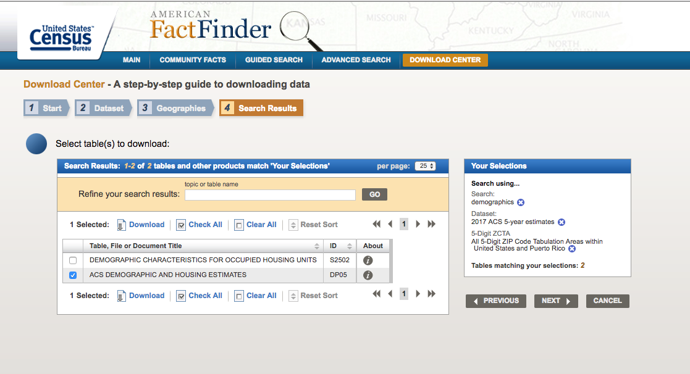

# Extracting US Census Data by Zip Code

This R script helps extract the population percentage estimates (for example, by race/ethnicity) from the 2017 American Community Survey - Demographic and Housing Estimates for relevant zip codes. This script also includes a way to calculate an entropy value that represents the diversity of different racial/ethnic groups in that particular zip code (i.e., a way to weigh the number and amount of different racial/ethnic groups in a zip code) using the R package 'philentropy.'

Before using this script, download the 2017 American Community Survey - Demographic and Housing Estimates from the US census website. Below is a screenshot of how to access and download the correct dataset file:

The file name of the dataset should be : ACS_17_5YR_DP05_with_ann.csv
